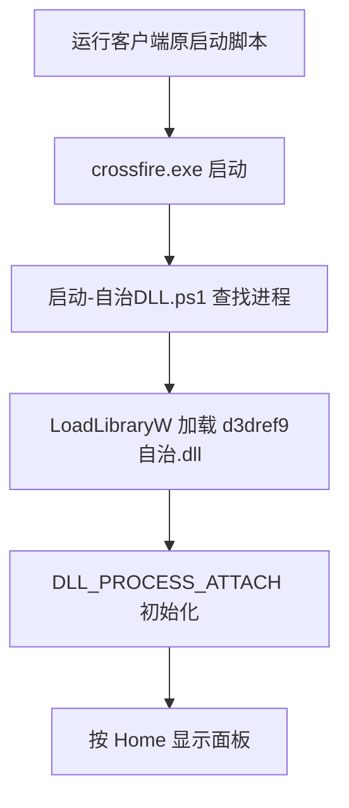

# d3dref9自治.dll 启动验证报告

## 结论

当前生成物是 x86 DLL，可作为独立模块加载到 `crossfire.exe`。它不是原客户端 `D3DREF9.DLL` 的兼容替换件，因此不能通过重命名并覆盖原文件启动。

## 已验证事实

- 生成物：`d3dref9自治.dll`，PE Machine `0x014C`（x86）。
- 导出：`d3dref9_initialize`、`d3dref9_shutdown`。
- DLL 自身在 `DLL_PROCESS_ATTACH` 创建工作线程、输入钩子、Home 面板和宏线程。
- 工程生成物不包含已删除的 IOC 字符串。
- `启动-自治DLL.ps1` 已通过 PowerShell 语法检查。

## 启动流程



## 复现命令

```powershell
cd 'C:\Users\15135\Documents\Codex\2026-08-31\jian\outputs\d3dref9自治'
powershell -NoProfile -ExecutionPolicy Bypass -File '.\启动-自治DLL.ps1' -Launch
```

或双击同目录的 `启动CF并加载自治DLL.bat`。

## 未验证边界

- 尚未在 CF 实机中确认注入返回值和面板显示。
- 原 `D3DREF9.DLL` 的 ordinal 1 调用约定仍未还原。
- 游戏地址相关的透视、无后坐力、生命、穿墙等 handler 仍未接入；当前工程不能宣称这些功能可用。

## 原 DLL 精简候选

已生成 `D3DREF9_精简候选.dll`（原文件副本，SHA-256：`9359CE4A23EB808BA13327EB2A55711B27985994B276A202439CAF386A2C0BD2`）。静态补丁覆盖 29 个已定位的网络、注册表、`ShellExecuteA`、`WinExec` 调用点，并清除已知 IOC 字符串；原导入表仍保留，且未做 CF 实机加载测试。该文件是测试候选，不是已经验证的全功能成品。
