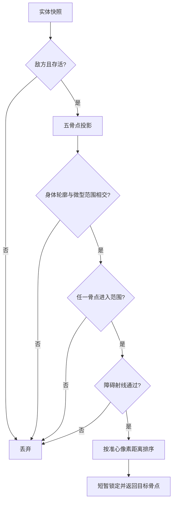

# 2026-09-07 微型范围自瞄筛选报告

## 结论

已把普通自瞄和瞬狙的目标资格判断统一为“微型范围 + 身体像素相交 + 障碍判断 + 最近目标”。TCII 源码确认“微型”对应 `自动瞄准磁性自瞄范围 = 16`，原始判定为屏幕中心矩形半宽/半高 `viewport/(1+16)`。

## 实现位置

- `include/entity_adapter.h`：新增骨骼屏幕投影和身体轮廓字段。
- `src/entity_adapter.cpp`：五个骨点分别做 WorldToScreen，并生成身体 AABB。
- `include/game_handlers.h`：新增 `AimConfig` 和目标短锁定状态。
- `src/game_handlers.cpp`：重写 `AcquireTarget()`，加入范围、可见性、最近目标和日志。
- `src/render_adapter.cpp`：恢复经过精确签名保护的 D3DX9 设备捕获入口。
- `config/d3dref9自治.ini`：新增 `[aim]` 参数。

## 目标判定流程



## 配置

```ini
[aim]
micro_range_divisor=16
micro_radius_px=0
body_padding_px=4
lock_hold_ms=80
switch_margin_px=3
auto_fire_interval_ms=20
visibility_required=true
visibility_fail_closed=true
```

`micro_radius_px=0` 使用 TCII 源码的微型范围；设置正数后使用该值作为准心圆形范围半径。`visibility_fail_closed=true` 时，无法取得本地对象、射线入口或射线调用异常都会拒绝目标。

## 验证结果

- MSVC Win32/x86 编译通过：`cmake --build build --config Release --target d3dref9_autonomy d3dref9_direct`。
- 直接替换版 PE：`Machine=0x014C`、`Functions=1`、`Names=0`、ordinal 1 有效。
- 独立 `LoadLibraryW`/ordinal 1 冒烟通过，返回 `1`。
- 已部署：`E:\game\已加速- CF2.0搭建（使用2012系统）\客户端\10.4CrossFire\D3DREF9.DLL`。
- 已创建回滚点：`D3DREF9.before-aim-20260907-003358.bak`。

## 实机确认

进入实际对局后，退出客户端再读取：

```powershell
$t = [IO.Path]::GetTempPath()
Get-Content (Join-Path $t 'd3dref9_handlers.log') -Tail 100
Import-Csv (Join-Path $t 'd3dref9_entities.csv') |
  Select-Object -Last 30 entity_slot,alive,enemy,pos_valid,bone_mask,screen_valid,body_valid,body_left,body_top,body_right,body_bottom,bone_screen_mask
```

预期：实体记录出现 `body_valid=1`、`bone_screen_mask` 非零；满足筛选后出现 `event=aim_target` 和 `event=aim_write`。若 `coord_table/pos_valid/bone_mask` 仍为 0，目标筛选不会写准心或发送自动开火，需继续修正运行时坐标表来源。
