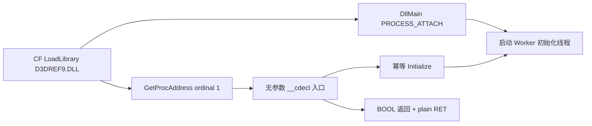

# ordinal 1 兼容层验证记录

## 原始备份（Observed）

文件：`E:\game\已加速- CF2.0搭建（使用2012系统）\客户端\D3DREF9wg.DLL`

- SHA-256：`E73FEC5C4692D06B136BE3D451A88BEE05921E0076E260C969F3C97C2A905A5A`
- PE：`Machine=0x014C`、`Magic=0x010B`
- 导出：仅 `ordinal 1`，RVA `0x4A7E`
- 入口：无参数形态、保存 `ESI/EDI/EBX`、末尾 `RET`，没有 `RET n`，因此调用方栈不由被调方清理。
- 入口返回时 `EAX` 来自原 DLL 内部的释放/状态调用；仅凭导出表无法证明固定常量返回值。

## 新产物（Observed）

文件：`C:\Users\15135\Documents\Codex\2026-08-31\jian\outputs\d3dref9自治\D3DREF9.DLL`

- PE：`Machine=0x014C`、`Magic=0x010B`
- 导出目录：`ExportBase=1 Functions=1 Names=0`
- 导出：仅 `ordinal 1`（`NONAME`）
- 入口：x86 无参数 `__cdecl`，普通 `RET`，不执行参数栈清理；入口启动自治初始化线程并在 `EAX` 返回 `BOOL` 成功状态。
- `DllMain(DLL_PROCESS_ATTACH)` 也会幂等启动同一初始化线程，避免 ordinal 调用顺序差异造成未初始化。

## 验证命令

```powershell
cd 'C:\Users\15135\Documents\Codex\2026-08-31\jian'
powershell -NoProfile -ExecutionPolicy Bypass -File '.\outputs\d3dref9自治\build.ps1'
python '.\outputs\d3dref9自治\tools\inspect_pe_exports.py' '.\outputs\d3dref9自治\D3DREF9.DLL'
```

期望：

```text
Machine=0x014C Magic=0x010B ExportBase=1 Functions=1 Names=0
ordinal 1: RVA 0x....
```

## 尚未证明的边界

1. 原 ordinal 1 的具体返回值依赖其内部状态，当前壳只能保证 ABI 形态和初始化成功状态，不能声称字节级复刻原内部逻辑。
2. 仍需在客户端副本中运行时验证：游戏能进入大厅/对局、模块实际从客户端目录加载、初始化线程无崩溃。
3. 实体、骨骼、矩阵、D3D9 绘制和功能处理器不属于本 Gate 的静态导出验证范围。

## 初始化链


