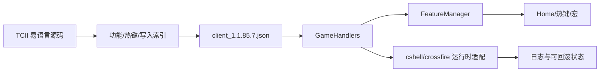

# 源码到自治 DLL 数据流

```mermaid
flowchart LR
  E[TCII 易语言源码] --> X[功能/热键/写入索引]
  X --> C[client_1.1.85.7.json]
  C --> H[GameHandlers]
  H --> F[FeatureManager]
  F --> I[Home/热键/宏]
  H --> M[cshell/crossfire 运行时适配]
  M --> L[日志与可回滚状态]
```
